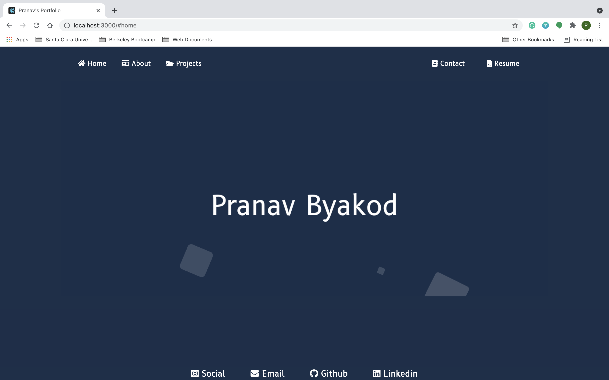
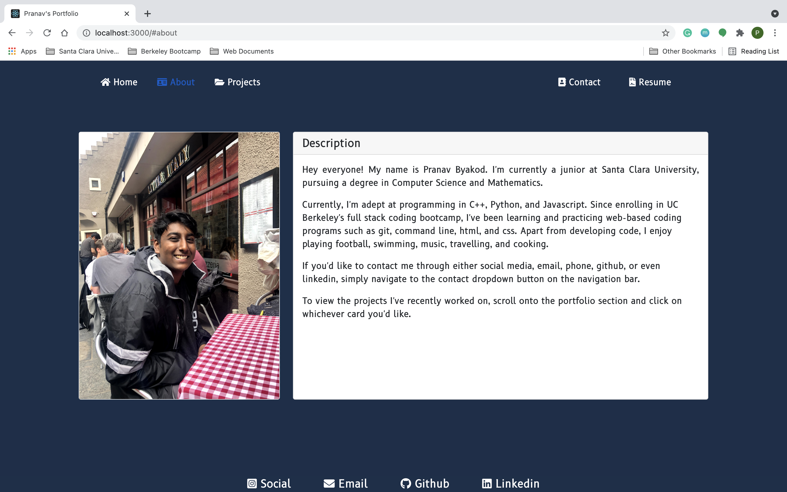
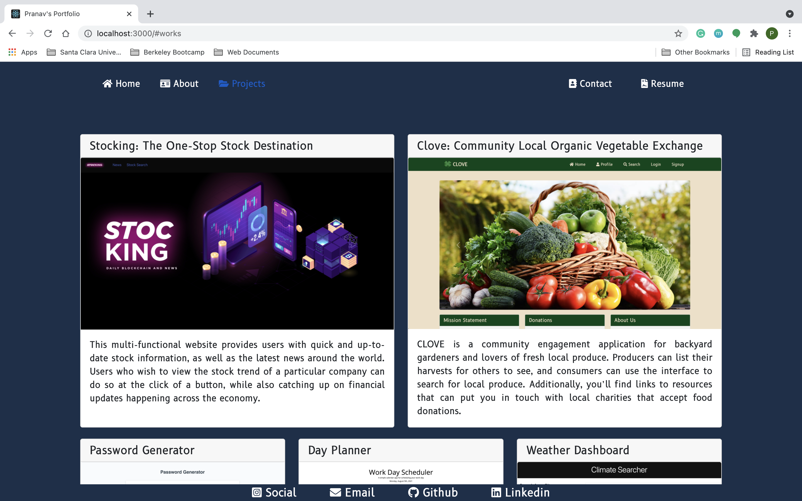
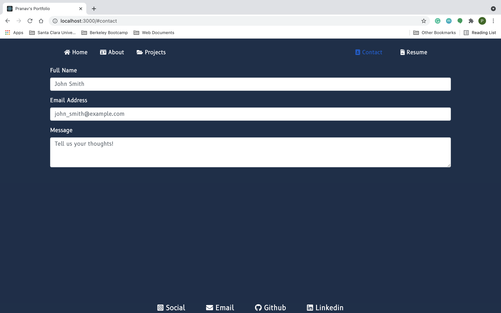
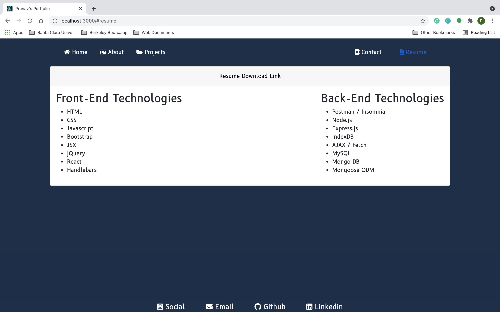

# React Portfolio

## Short Description

This updated portfolio (using React technologies) displays some of the biggest projects I've worked and collaborated on in recent weeks.

## Website Preview

Home Page

About Me Page

Projects Page

Contact Page

Resume Page

## Features

1. Navigation bar that allows users to navigate across page.
2. Home page with cool animated header.
3. About section that details information about me (with a picture).
4. Project section that illustrates and links some of my biggest projects.
5. Contact button with a form to contact me.
6. Resume button that takes the user to a pdf version of my resume and displays my front and back end skills.

## Deployed Link

https://pbyakod.github.io/react-portfolio/

## Technologies Used

HTML, CSS, Javascript, Bootstrap, Node.js, React

## Author Page

Pranav Byakod [<a href="https://github.com/pbyakod">Github Profile</a>]